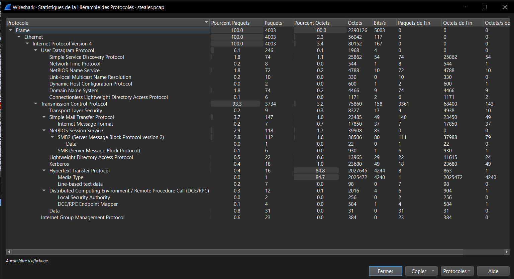
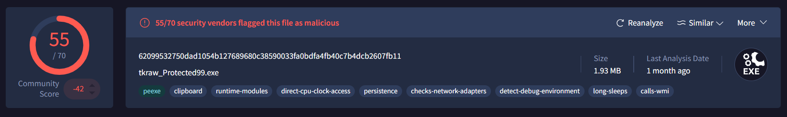

# 🕵️‍♂️ CD Challenge – Network Analysis: HawkEye Lab

🔗 **Challenge link:** [cyberdefenders Labs Online](https://cyberdefenders.org/blueteam-ctf-challenges/hawkeye/)  
📂 **Category:** Network Analysis  
🗂️ **File analyzed:** `stealer.pcap`

---

## 🎯 Objective
Reconstruct a HawkEye Keylogger data exfiltration incident by analyzing captured network traffic using Wireshark and CyberChef, with the aim of identifying Indicators of Compromise (IoCs), detecting stolen credentials, and understanding the attacker’s techniques.

---
## 🔍 Analysis Steps

1-Traffic Timeline
**Interpretation:**  
The malicious HawkEye exfiltration activity occurred within a one-hour window. This timeframe is consistent with keylogger behavior, where stolen credentials are collected and exfiltrated shortly after infection. 

- **First Packet:** 2019-04-10 22:37:07  
- **Last Packet:** 2019-04-10 23:40:48  
- **Total Duration:** 1 hour, 3 minutes, 41 seconds  

2-Protocol Analysis

The **Protocol Hierarchy Statistics** from Wireshark shows the following key points:

- **Total Packets:** 4003  
- **Main Transport Protocols:**
  - **TCP:** 93.3% of traffic (3734 packets)  
  - **UDP:** 6.1% of traffic (246 packets)  

- **Application Layer Protocols observed:**
  - **SMTP (Simple Mail Transfer Protocol):** 3.7% of packets → Indicates exfiltration via email.  
  - **SMB / NetBIOS:** 2.9% of packets → Local network activity.  
  - **HTTP:** Small presence, but carries significant payload (2 MB).  
  - **TLS:** Minimal, only 9 packets (encrypted connections).  
  - **DCE/RPC & Kerberos:** Related to Windows services and authentication traffic.  

- **Notable Finding:**  
  The presence of **SMTP traffic** strongly suggests that the HawkEye keylogger attempted to exfiltrate stolen data using email. This aligns with known TTPs (Tactics, Techniques, and Procedures) of HawkEye malware, which often sends credentials via SMTP to attacker-controlled email accounts.

3- Key Connections Summary

| Source (Victim) | Destination        | Packets | Data Size | Observation                          |
|-----------------|--------------------|---------|-----------|--------------------------------------|
| 10.4.10.132     | 217.182.138.150    | 2947    | 2 MB      | **Suspicious – Possible Data Exfiltration (SMTP C2)** |
| 10.4.10.132     | 23.229.162.69      | 280     | 39 KB     | External communication               |
| 10.4.10.132     | 66.171.248.178     | 63      | 5 KB      | External communication               |
| 10.4.10.132     | 216.58.193.131     | 20      | 8 KB      | Likely Google service (legitimate)   |
| 10.4.10.132     | Local Broadcasts   | ~100    | Small     | Normal LAN traffic                   |

**Conclusion:** The connection with `217.182.138.150` stands out as the most suspicious, indicating potential data exfiltration activity.

## 📨 SMTP Exfiltration Evidence

### SMTP Handshake
- Server: `p3plcpnl0413.prod.phx3.secureserver.net` (Exim 4.91)
- Greeting: Server does **not authorize bulk/unsolicited email**
- Client EHLO: `Beijing-5cd1-PC` (`173.66.146.112`)

### Authentication
- Method: `AUTH LOGIN`
- Username (Base64 decoded): **[REDACTED]**
- Password (Base64 decoded): **[REDACTED]**
- ✅ Authentication succeeded.

### Email Transaction
- **MAIL FROM**: **[REDACTED]**
- **RCPT TO**: **[REDACTED]**
- Subject (decoded): `HawkEye Keylogger - Reborn v9 - Passwords Logs - Victim Host`
- Message contains **keylogger logs**.

### Extracted Content
The email body (Base64 decoded) reveals **credentials harvested by HawkEye Keylogger**.  
(Actual usernames, emails, and passwords have been **redacted** for security.)

Example categories of stolen data:
- **Webmail credentials** (e.g., AOL, Gmail, etc.)
- **Banking logins** (e.g., online banking portals)
- **Corporate email accounts** (e.g., Outlook / POP3 / SMTP)

### Indicators
- SMTP used as **C2 / exfiltration channel** through a legitimate mail server.
- Multiple credential categories exfiltrated (personal + corporate).
- Malware identified: **HawkEye Reborn v9 (Keylogger)**.

### Conclusion
The attacker successfully **exfiltrated sensitive credentials** to their own mailbox via SMTP.  
This confirms:
- **Data exfiltration over email (C2 channel)**  
- **Use of stolen corporate + personal credentials**  
- **HawkEye Keylogger v9 active on host `BEIJING-5CD1-PC (173.66.146.112)`**

## 🛑 Malware Sample Analysis (VirusTotal)

### Overview
A suspicious executable file was analyzed on VirusTotal.  
- Size: ~1.9 MB  
- Type: Windows executable (PE32)  
- Detection: Flagged as malicious by the majority of antivirus vendors.  
- Family: Classified as a **Trojan** and linked to the **HawkEye Keylogger** malware.  

### Behavior
The file shows typical malware characteristics:  
- Attempts to **persist** on the system.  
- **Evasion techniques** such as detecting debugging environments and using long sleep delays.  
- **Information stealing** behavior, consistent with keylogger activity.  
- **Network communication** likely used for data exfiltration.  

### Conclusion
This sample is identified as a **HawkEye Keylogger variant**, commonly delivered via phishing emails.  
It is primarily designed to **steal sensitive credentials** and **exfiltrate them via email (SMTP)**.  

## 📅 Timeline of Events

- **April 10, 2019 @ 20:37:54 UTC**  
  - User accessed the domain: `proforma-invoices.com`.  
  - A file named **`tkraw_protected99.exe`** was requested.  
  - The file was classified as a **Trojan (HawkEye Keylogger)**, typically delivered via phishing campaigns.  

- **April 10, 2019 @ 20:38:15 UTC**  
  - Host: `BEIJING-5CD1-PC`.  
  - Queried the domain: `whatismyipaddress.com`.  
  - This activity is consistent with malware checking external connectivity.  

- **April 10, 2019 @ 20:38:16 UTC**  
  - Connection established to a mail server (`IP: 23.229.162.69`).  
  - Authenticated user: **[REDACTED]** (attacker-controlled email).  
  - Stolen credentials related to the victim were exfiltrated via SMTP.  

- **April 10, 2019 @ 21:38:43 UTC**  
  - The **same credentials and logs** were resent to the same email address.  

- **April 10, 2019 @ 21:40:04 UTC**  
  - **Last observed mail activity** related to HawkEye exfiltration.  

---

### 🕒 Duration Summary
- **Time Range:** 20:37:54 – 21:40:04 UTC  
- **Total Duration:** **1 hour, 2 minutes, 10 seconds**

---
## 🔗 MITRE ATT&CK Mapping

- **Initial Access (T1566.001):** Phishing via malicious attachment/URL (`proforma-invoices.com`).  
- **Execution (T1059):** User executed `tkraw_protected99.exe`.  
- **Persistence (T1547):** Malware shows persistence mechanisms.  
- **Credential Access (T1056.001):** Keylogging activity observed.  
- **Exfiltration (T1048.003):** Exfiltration over SMTP (to attacker-controlled email).  
- **Command and Control (T1071.003):** Use of application layer protocol (SMTP) as C2 channel.

## ⚠️ Disclaimer
This report is part of a **CTF / educational challenge**.  
All information (usernames, emails, passwords, domains) is **fictional or simulated**.  
Any resemblance to real data is purely coincidental.
